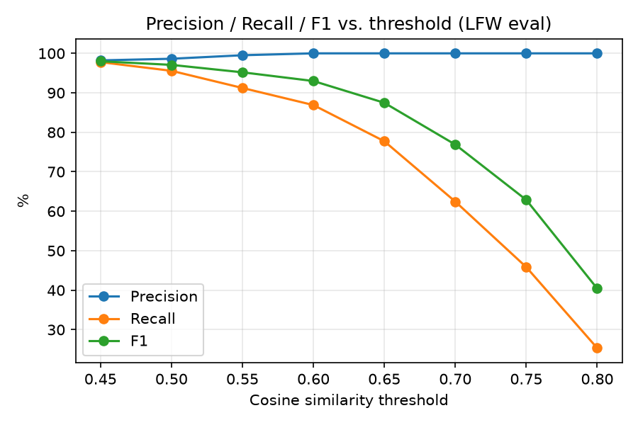

# Face Detection & Recognition Pipeline (RetinaFace + AdaFace + FAISS)

An end-to-end face detection, alignment, embedding, and duplicate/identity-matching pipeline, built on top of [RetinaFace](https://arxiv.org/abs/1905.00641) for detection and [AdaFace](https://github.com/mk-minchul/AdaFace) for recognition embeddings, with a FAISS vector index (wrapped via LangChain) for fast similarity search.

**Pipeline:** `RetinaFace detection → 5-point landmark alignment → AdaFace embedding → FAISS similarity search → duplicate/new-identity decision`

This project started as a fork of [biubug6/Pytorch_Retinaface](https://github.com/biubug6/Pytorch_Retinaface) (a PyTorch RetinaFace implementation). The detector code and WIDER FACE / FDDB benchmark numbers below are from the original repo; everything from "Face Recognition & Deduplication Pipeline" onward is this project's contribution.

## Contents
- [Face Recognition & Deduplication Pipeline](#face-recognition--deduplication-pipeline)
- [Setup](#setup)
- [Usage](#usage)
- [Evaluation](#evaluation)
- [Repo Layout](#repo-layout)
- [RetinaFace Detector (base repo)](#retinaface-detector-base-repo)

## Face Recognition & Deduplication Pipeline

Given a new image, the pipeline:
1. **Detects** faces and 5-point landmarks with RetinaFace (`face_detector.py`, weights in `weights/`).
2. **Aligns** each detected face to a canonical pose using the landmarks (`face_alignment/align.py`, `face_aligner.py`).
3. **Embeds** each aligned face into a 512-D vector. Three embedding backbones were evaluated — FaceNet (VGGFace2), ArcFace (InsightFace `buffalo_l`), and AdaFace (`ir_50`, WebFace4M) — see `demo.ipynb` for the comparison. **AdaFace** is used in the production pipeline (`face_pipeline_adaface.py`) as it gave the cleanest same/different-identity separation on validation crops.
4. **Searches** a FAISS index (`IndexFlatIP` over L2-normalized embeddings, so inner product = cosine similarity) for the closest existing face.
5. **Decides**: if similarity ≥ threshold, the face is flagged as a duplicate of an existing identity; otherwise it's registered as a new identity and stored in `face_database/`.

The FAISS index is wrapped with LangChain's `FAISS` vector store (`langchain_faiss.py`) so each vector carries a `face_id` (and source-image) as metadata, enabling identity lookups beyond raw nearest-neighbor search.

## Setup

```bash
pip install -r requirements.txt
```

Download and place model weights:
```
./weights/
    Resnet50_Final.pth            # RetinaFace detector (see original repo links below)
    mobilenet0.25_Final.pth
    mobilenetV1X0.25_pretrain.tar
./pretrained/
    adaface_ir50_webface4m.ckpt   # AdaFace embedder — https://github.com/mk-minchul/AdaFace
```

## Usage

Walk through the full pipeline interactively in [`demo.ipynb`](demo.ipynb), or run the stages directly:

```bash
# 1. Detect faces in an image
python detect.py --network resnet50

# 2. Generate embeddings for a folder of cropped/aligned faces (FaceNet baseline)
python embeddings.py

# Build a FAISS index from those embeddings
python database.py
python langchain_faiss.py

# 3. Run the full AdaFace pipeline: detect -> align -> embed -> dedup-check -> store
python face_pipeline_adaface.py --input ./inference_image --threshold 0.75
```

## Evaluation

`evaluation.py` measures duplicate/identity-matching quality on a gallery/probe dataset:
```
./<eval_dir>/
    person_001/
        img1.jpg        # enrolled (gallery)
        img_dup1.jpg     # probe
    person_002/
        ...
```
The first image per identity is enrolled into the gallery; every other image is queried against it (top-1 cosine similarity search). Reports precision, recall, F1, detection success rate, false-positive rate, and average inference time.

**Two evaluation sets, testing two different things:**

1. **`evaluation_images/`** — synthetic near-duplicates. `create_augmented_dataset.py` generates crop/rotate/brightness variants of a single clean photo per identity. This tests tolerance to minor image edits (e.g. re-uploads, re-compression), not general face recognition — embeddings barely move under small crops/brightness shifts, so this set scores ~100% precision/recall and is not a meaningful accuracy claim on its own.
2. **`lfw_evaluation_images/`** — real, distinct photographs of the same person from [LFW (Labeled Faces in the Wild)](http://vis-www.cs.umass.edu/lfw/), with genuine pose/lighting/expression variation. `build_lfw_eval_set.py` builds this set from a public LFW mirror (60 identities, 4–6 images each). This is the meaningful benchmark:

```bash
python build_lfw_eval_set.py --num-identities 60 --min-images 4 --max-images 6
python evaluation.py --data ./lfw_evaluation_images --weights ./weights/Resnet50_Final.pth --threshold 0.75
```

**Result** (FaceNet/VGGFace2 embeddings, RetinaFace-ResNet50 detector, threshold=0.75, 60 gallery identities / 229 probes):

| Precision | Recall | F1 | False-positive rate |
|:-:|:-:|:-:|:-:|
| 100.0% | 45.9% | 62.9% | 0.0% |

The similarity threshold clearly trades recall for precision — `threshold_sweep.py` computes embeddings once and sweeps thresholds to quantify that tradeoff ([full table](results/threshold_sweep_lfw.txt)):

| threshold | precision | recall | F1 | FPR |
|:-:|:-:|:-:|:-:|:-:|
| 0.45 | 98.2% | 97.8% | 98.0% | 1.75% |
| 0.50 | 98.6% | 95.6% | 97.1% | 1.31% |
| 0.55 | 99.5% | 91.2% | 95.2% | 0.44% |
| 0.60 | 100.0% | 86.9% | 93.0% | 0.00% |
| 0.65 | 100.0% | 77.7% | 87.5% | 0.00% |
| 0.70 | 100.0% | 62.4% | 76.9% | 0.00% |
| 0.75 | 100.0% | 45.9% | 62.9% | 0.00% |
| 0.80 | 100.0% | 25.3% | 40.4% | 0.00% |

<p align="center"></p>

```bash
python threshold_sweep.py --data ./lfw_evaluation_images --output ./results/threshold_sweep_lfw.txt --plot ./results/pr_curve_lfw.png
```

Takeaway: at the pipeline's default threshold (0.75), the system never misidentifies one person as another (0% FPR across all thresholds ≥0.60), but only recognizes ~46% of genuinely varied real-world photos of the same person as a duplicate — a conservative operating point appropriate for a dedup/registration gate, but too strict for a "did we already see this person" identification use case. Lowering to ~0.5–0.55 trades a small false-positive rate (~0.4–1.3%) for substantially higher recall (91–96%).

LFW images are downloaded transiently for benchmarking only (see `build_lfw_eval_set.py`); the `lfw_evaluation_images/` folder is gitignored and not redistributed in this repo.

## Repo Layout

| Path | Purpose |
|---|---|
| `face_detector.py` | RetinaFace wrapper for detection + landmarks |
| `face_aligner.py`, `face_alignment/` | Face alignment utilities (landmark-based warp) |
| `embeddings.py` | Batch FaceNet (VGGFace2) embedding generation |
| `adaface_embeddings.py`, `net.py` | AdaFace embedding generation + backbone loader |
| `database.py` | Build a FAISS index from a CSV of embeddings |
| `langchain_faiss.py` | Wrap a raw FAISS index in a LangChain vector store with `face_id` metadata |
| `faiss_store.py` | Shared LangChain/FAISS load-save helpers used by both pipeline variants |
| `face_pipeline.py` / `face_pipeline_adaface.py` | Full detect→align→embed→dedup pipeline (FaceNet / AdaFace variants — different embedders use different alignment strategies, see code) |
| `evaluation.py` | Precision/recall/F1 evaluation on a gallery/probe dataset |
| `create_augmented_dataset.py` | Generate synthetic probe duplicates for evaluation |
| `build_lfw_eval_set.py` | Build a real-photo gallery/probe eval set from the LFW dataset |
| `threshold_sweep.py` | Precision/recall/F1 vs. similarity-threshold tradeoff + plot |
| `train.py`, `test_widerface.py`, `test_fddb.py`, `detect.py` | Original RetinaFace training/eval/inference scripts |
| `AdaFace/` | Vendored upstream [AdaFace](https://github.com/mk-minchul/AdaFace) repo (embedding model source, own license) |

## RetinaFace Detector (base repo)

A [PyTorch](https://pytorch.org/) implementation of [RetinaFace: Single-stage Dense Face Localisation in the Wild](https://arxiv.org/abs/1905.00641). Model size only 1.7M when using mobilenet0.25 as backbone; resnet50 is also provided for better accuracy. Official Mxnet code [here](https://github.com/deepinsight/insightface/tree/master/RetinaFace).

### WiderFace Val Performance (single scale, ResNet50 backbone)
| Style | easy | medium | hard |
|:-|:-:|:-:|:-:|
| Pytorch (same parameter with Mxnet) | 94.82 % | 93.84% | 89.60% |
| Pytorch (original image scale) | 95.48% | 94.04% | 84.43% |
| Mxnet | 94.86% | 93.87% | 88.33% |
| Mxnet (original image scale) | 94.97% | 93.89% | 82.27% |

### WiderFace Val Performance (single scale, Mobilenet0.25 backbone)
| Style | easy | medium | hard |
|:-|:-:|:-:|:-:|
| Pytorch (same parameter with Mxnet) | 88.67% | 87.09% | 80.99% |
| Pytorch (original image scale) | 90.70% | 88.16% | 73.82% |
| Mxnet | 88.72% | 86.97% | 79.19% |
| Mxnet (original image scale) | 89.58% | 87.11% | 69.12% |
<p align="center"></p>

### FDDB Performance
| FDDB (pytorch) | performance |
|:-|:-:|
| Mobilenet0.25 | 98.64% |
| Resnet50 | 99.22% |
<p align="center"></p>

### Training

1. Download [WIDERFACE](http://shuoyang1213.me/WIDERFACE/WiderFace_Results.html) and the bbox/landmark annotations from [baidu cloud](https://pan.baidu.com/s/1Laby0EctfuJGgGMgRRgykA) or [dropbox](https://www.dropbox.com/s/7j70r3eeepe4r2g/retinaface_gt_v1.1.zip?dl=0), organized as:
```
./data/widerface/
    train/images/, label.txt
    val/images/, wider_val.txt
```
2. Check network config (`batch_size`, `min_sizes`, `steps`, etc.) in `data/config.py` and `train.py`.
3. Train:
```bash
CUDA_VISIBLE_DEVICES=0,1,2,3 python train.py --network resnet50
CUDA_VISIBLE_DEVICES=0 python train.py --network mobile0.25
```

### Detector Evaluation

**WiderFace val:**
```bash
python test_widerface.py --trained_model weight_file --network mobile0.25  # or resnet50
cd ./widerface_evaluate
python setup.py build_ext --inplace
python evaluation.py
```
**FDDB:**
```bash
python test_fddb.py --trained_model weight_file --network mobile0.25  # or resnet50
```
Download images to `./data/FDDB/images/`; use [eval_tool](https://bitbucket.org/marcopede/face-eval) to score.

### References
- [FaceBoxes](https://github.com/zisianw/FaceBoxes.PyTorch)
- [Retinaface (mxnet)](https://github.com/deepinsight/insightface/tree/master/RetinaFace)
- [AdaFace: Quality Adaptive Margin for Face Recognition](https://github.com/mk-minchul/AdaFace)

```
@inproceedings{deng2019retinaface,
title={RetinaFace: Single-stage Dense Face Localisation in the Wild},
author={Deng, Jiankang and Guo, Jia and Yuxiang, Zhou and Jinke Yu and Irene Kotsia and Zafeiriou, Stefanos},
booktitle={arxiv},
year={2019}
}
```
